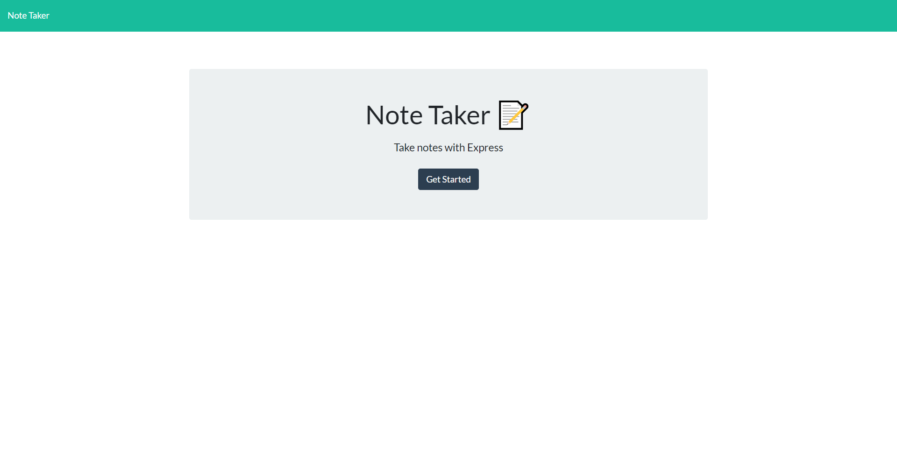

## Note-taker

## Heroku

https://protected-tundra-15221.herokuapp.com/

## Installation

1. Clone from GitHub
2. Open project directory, then npm install to install all dependencies

## User Story

AS A small business owner,
I WANT to be able to write and save notes,
SO THAT I can organize my thoughts and keep track of tasks I need to complete.

## Screenshot

